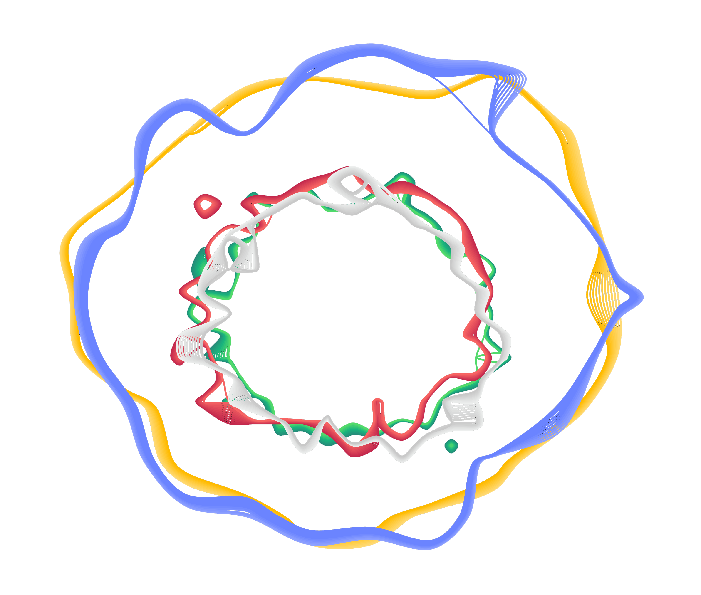
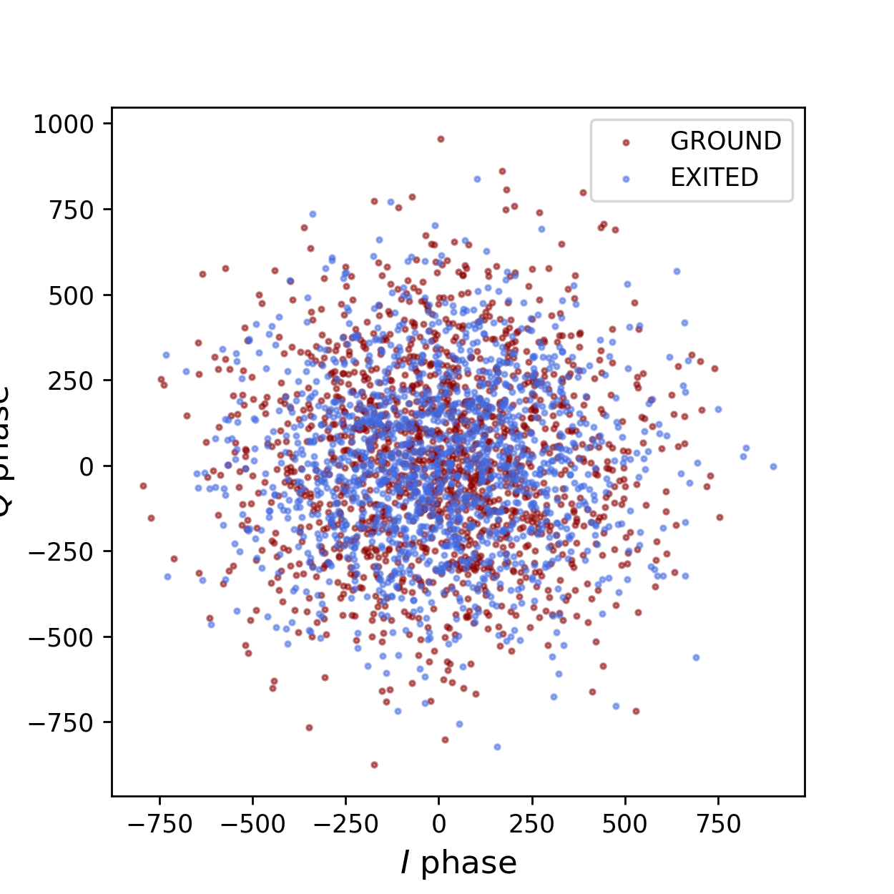
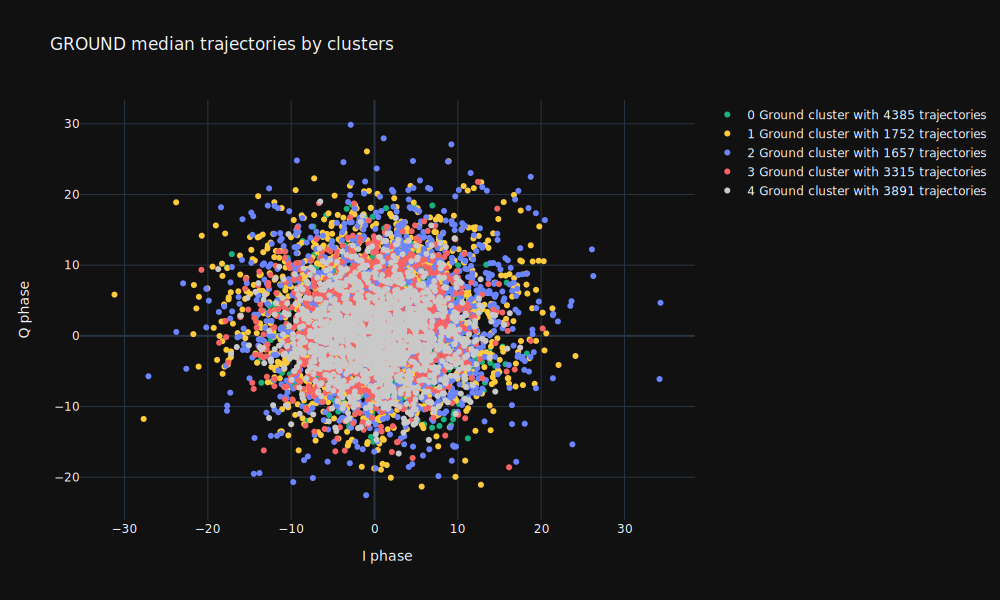
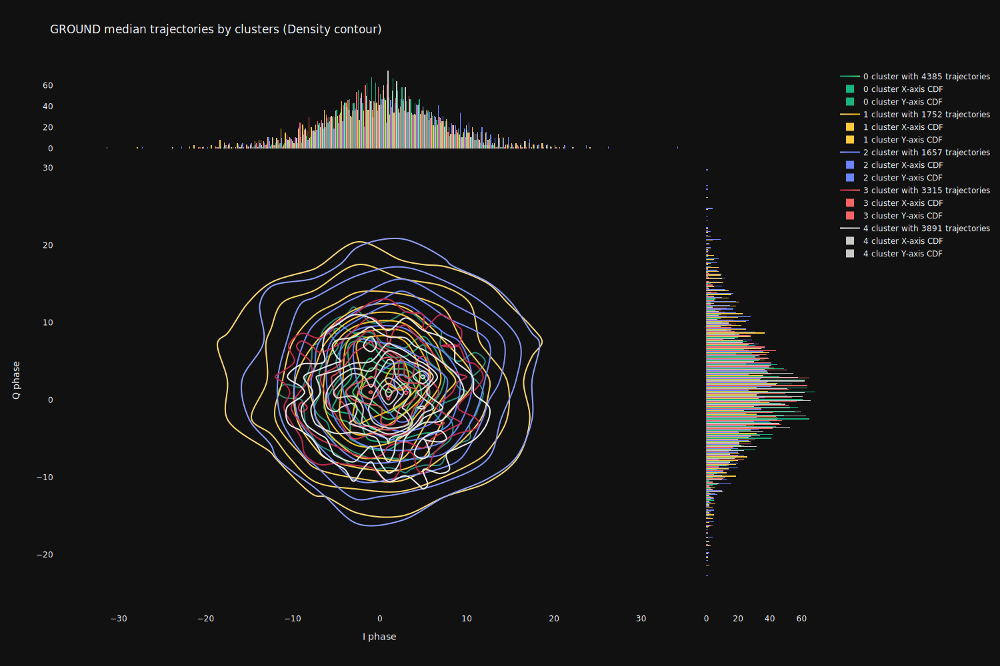
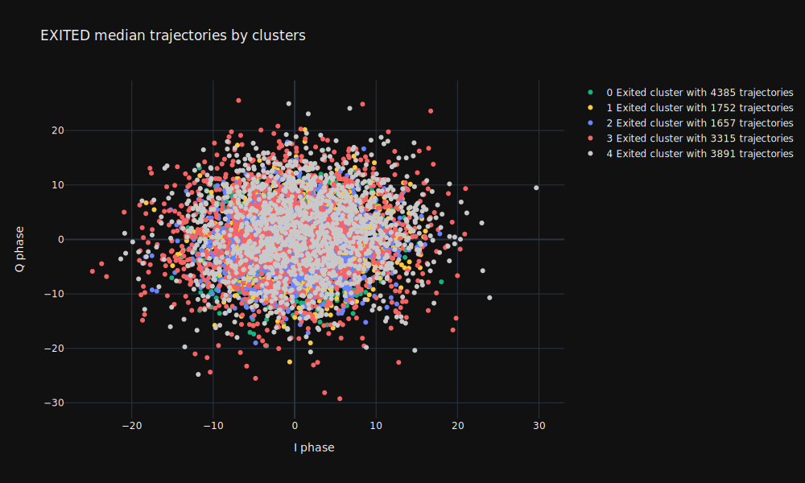
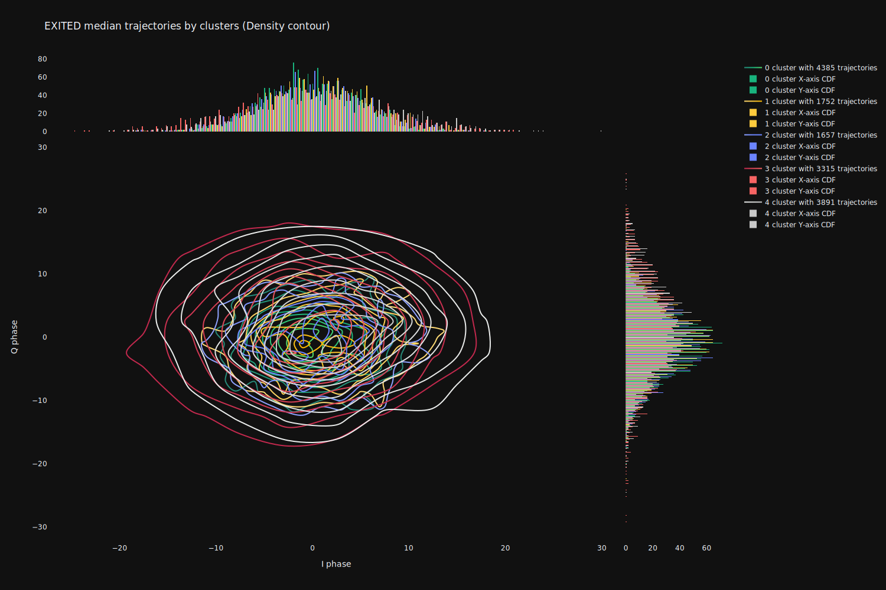
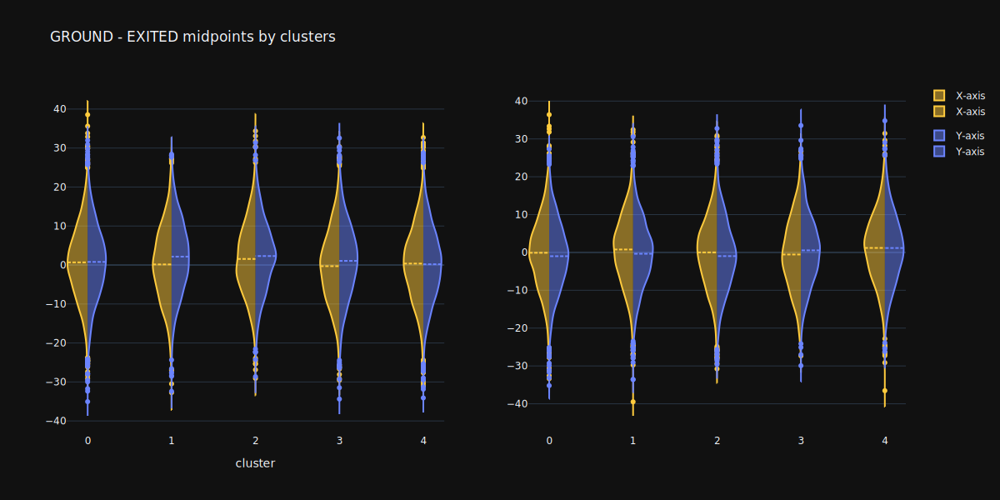

<h1 align="center">
  <a href="https://github.com/ikaryss/quantum-trajectory-clustering">
    <!-- Please provide path to your logo here -->
    
  </a>
</h1>

<div align="center">
  Quantum trajectories clustering
  <br />
  <a href="#about"><strong>Explore the screenshots »</strong></a>
  <br />
  <br />
  <a href="https://github.com/ikaryss/quantum-trajectory-clustering/issues/new?assignees=&labels=bug&template=01_BUG_REPORT.md&title=bug%3A+">Report a Bug</a>
  ·
  <a href="https://github.com/ikaryss/quantum-trajectory-clustering/issues/new?assignees=&labels=enhancement&template=02_FEATURE_REQUEST.md&title=feat%3A+">Request a Feature</a>
  .
  <a href="https://github.com/ikaryss/quantum-trajectory-clustering/issues/new?assignees=&labels=question&template=04_SUPPORT_QUESTION.md&title=support%3A+">Ask a Question</a>
</div>

<div align="center">
<br />

[](LICENSE)

[](https://github.com/ikaryss/quantum-trajectory-clustering/issues?q=is%3Aissue+is%3Aopen+label%3A%22help+wanted%22)
[](https://github.com/ikaryss)

</div>

<details open="open">
<summary>Table of Contents</summary>

- [About](#about)
- [Getting Started](#getting-started)
  - [Prerequisites](#prerequisites)
  - [Installation](#installation)
- [Usage](#usage)
- [Roadmap](#roadmap)
- [Support](#support)
- [Contributing](#contributing)
- [Authors & contributors](#authors--contributors)
- [License](#license)
- [Acknowledgements](#acknowledgements)

</details>

---

## About  
Clustering raw qubit measurements to evaluate the quality of superconducting qubit circuits and move forward in understanding the sources of noise in measurements.  
Сlustering was performed using a [hierarchical clustering algorithm](https://github.com/dmuellner/fastcluster) with ward linkage over a computable array of [SSPD (Symmetric Segment-Path Distance)](https://arxiv.org/pdf/1508.04904.pdf) distances between trajectories.  
Distances computation was performed on google cloud. The results of clustering into 5 clusters are shown in figure section. If you want to experiment with sample data, you can find it on [Kaggle](https://www.kaggle.com/datasets/nikolayzhitkov/quantum-singleshot-measurements)
> High-fidelity measurements are important for the physical implementation of quantum information protocols. Current methods for classifying measurement trajectories in superconducting qubit systems produce fidelities that are systematically lower than those predicted by experimental parameters.
> Maximizing the information one can extract from a physical system requires the ability to perform accurate measurements. Our goal is to provide methods
for diagnosing measurement errors and increasing fidelities
by using various machine learning algorithms.  
> One way to solve such problems is to cluster quantum trajectories (or singleshots) and find some features in the data that are related to noise effects, heating effects, or qubit relaxation time.  
> We get our qubit measurements by driving the resonator and recording the output trajectory in phase (I-Q) space. It is very noisy data.  
> You can see examples of such singleshots of qubits in the excited and ground states in the screenshot section.  
> If you want to learn more about how single-shot clusterization can help us improve readout measurements - you can read [this work](https://arxiv.org/abs/1411.4994) that inspired us to research
> 

<details>
<summary>Screenshots</summary>
<br>  
Ground and exited singleshot measurement example  

   

---
Qubit ground state singleshots clustering results  
 > median singleshots by clusters are shown  

  

Histograms and level lines of the empirical distribution law (contours)  

  

---
Qubit exited state singleshots clustering results  
 > median singleshots by clusters are shown  

  

Histograms and level lines of the empirical distribution law (contours)  

  

---
Ground and exited midpoints distribution by axis  

  

---
Ground and exited cluster's growth rate  
 > How fast instances of each cluster appear in dataset  

  
</details>

## Getting Started

### Prerequisites

> All project requirements/dependencies (except [traj-dist](https://github.com/bguillouet/traj-dist)) are represented in [pyproject.toml](pyproject.toml) file. You can easily install all deps to your anaconda environment with [Poetry](https://python-poetry.org/). So you only need to download Poetry and traj-dist before installation.

### Installation

> 1. clone repo
> 2. create new environment via conda (you can use [environment file](environment.yaml))  
> ```conda env create -f environment.yaml```
> 3. install dependencies with poetry  
> ``poetry install``
> 4. intall [traj-dist](https://github.com/bguillouet/traj-dist)  
> You can install it with pip or poetry.

## Usage

> You can load [raw and pre-calculated data on Kaggle](https://www.kaggle.com/datasets/nikolayzhitkov/quantum-singleshot-measurements).  
> Dataset consists of:  
> 1. raw_data folder 🐖  
> Put here single-shots (raw signals coming from devices)  
> 2. trajectory_data folder 🥓  
> trajectory data calculated with [trajectory_generate](trajectory_generate.ipynb) file.  
> 3. result_data folder 🥙  
> SSPD distance matrix computed with [compute_distance_matrix](compute_distance_matrix.py) file.  
> **We compute distance matrix with Google Cloud on 128-core processor, and it took about 3 days to be finished. The computation took so long, even using all cores, because each single shot consists of 1500 x-y points. To fill the SSPD matrix for 15,000 such singleshots - you need to calculate about 120 million distances. For trajectories consisting of 1500 points, the distances are computed using cython in about 0.07 seconds.**  
> So you don't have to do these calculations - you can simply download a pre-calculated SSPD matrix 🙃
> 4. [clustering_and_visualizing](clustering_and_visualizing.ipynb) file is responsible for data visualization 📈

## Roadmap

See the [open issues](https://github.com/ikaryss/quantum-trajectory-clustering/issues) for a list of proposed features (and known issues).

- [Top Feature Requests](https://github.com/ikaryss/quantum-trajectory-clustering/issues?q=label%3Aenhancement+is%3Aopen+sort%3Areactions-%2B1-desc) (Add your votes using the 👍 reaction)
- [Top Bugs](https://github.com/ikaryss/quantum-trajectory-clustering/issues?q=is%3Aissue+is%3Aopen+label%3Abug+sort%3Areactions-%2B1-desc) (Add your votes using the 👍 reaction)
- [Newest Bugs](https://github.com/ikaryss/quantum-trajectory-clustering/issues?q=is%3Aopen+is%3Aissue+label%3Abug)

## Support


Reach out to the maintainer at one of the following places:

- [GitHub issues](https://github.com/ikaryss/quantum-trajectory-clustering/issues/new?assignees=&labels=question&template=04_SUPPORT_QUESTION.md&title=support%3A+)
- Contact options listed on [this GitHub profile](https://github.com/ikaryss)


## Contributing

First off, thanks for taking the time to contribute! Contributions are what make the open-source community such an amazing place to learn, inspire, and create. Any contributions you make will benefit everybody else and are **greatly appreciated**.


Please read [our contribution guidelines](docs/CONTRIBUTING.md), and thank you for being involved!

## Authors & contributors

The original setup of this repository is by [Nikolay Zhitkov](https://github.com/ikaryss).

For a full list of all authors and contributors, see [the contributors page](https://github.com/ikaryss/quantum-trajectory-clustering/contributors).


## License

This project is licensed under the **MIT license**.

See [LICENSE](LICENSE) for more information.

## Acknowledgements

> 1. [Machine learning for discriminating quantum measurement trajectories and improving readout](https://arxiv.org/abs/1411.4994)
> 2. [Review and Perspective for Distance Based Trajectory Clustering](https://arxiv.org/abs/1508.04904)
> 3. [SSPD distance package](https://github.com/bguillouet/traj-dist)
> 4. [Fastcluster](http://danifold.net/fastcluster.html)
